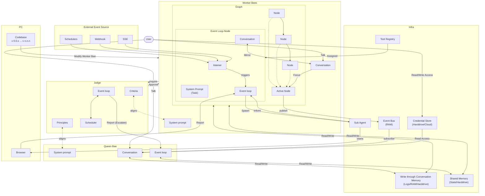

# Hive Agent Framework: Triangulated Verification for Reliable Goal-Driven Agents

## System Architecture Overview

The Hive framework is organized around five core subsystems that collaborate to execute goal-driven agents reliably. The following diagram shows how these subsystems connect:



### Key Subsystems

| Subsystem           | Role        | Description                                                                                                                                                                                                                                                  |
| ------------------- | ----------- | ------------------------------------------------------------------------------------------------------------------------------------------------------------------------------------------------------------------------------------------------------------ |
| **Event Loop Node** | Entry point | Listens for external events (schedulers, webhooks, SSE), triggers the event loop, and spawns sub-agents. Its conversation mirrors the Worker Bees conversation for context continuity.                                                                       |
| **Worker Bees**     | Execution   | A graph of nodes that execute the actual work. Each node in the graph can become the Active Node. Workers maintain their own conversation and system prompt, and read/write to shared memory.                                                                |
| **Judge**           | Evaluation  | Evaluates Worker Bee output against criteria (aligned with Worker system prompt) and principles (aligned with Queen Bee system prompt). Runs on a scheduled event loop and escalates to the Queen Bee when needed.                                           |
| **Queen Bee**       | Oversight   | The orchestration layer. Subscribes to Active Node events via the Event Bus, receives escalation reports from the Judge, and has read/write access to shared memory and credentials. Users can talk directly to the Queen Bee.                               |
| **Infra**           | Services    | Shared infrastructure: Tool Registry (assigned to Event Loop Nodes), Write-through Conversation Memory (logs across RAM and disk), Shared Memory (state on disk), Event Bus (pub/sub in RAM), Credential Store (encrypted on disk or cloud), and Sub Agents. |

### Data Flow Patterns

- **External triggers**: Schedulers, Webhooks, and SSE events flow into the Event Loop Node's listener, which triggers the event loop to spawn sub-agents or start browser-based tasks.
- **User interaction**: Users talk directly to Worker Bees (for task execution) or the Queen Bee (for oversight). Users also have read/write access to the Credential Store.
- **Worker-Judge loop**: Worker Bees inquire with the Judge after completing work. The Judge approves the output or escalates to the Queen Bee.
- **Pub/Sub**: The Active Node publishes events to the Event Bus. The Queen Bee subscribes for real-time visibility.
- **Adaptiveness**: The Codebase modifies Worker Bees, enabling the framework to evolve agent graphs across versions.

---

## The Core Problem: The Ground Truth Crisis in Agentic Systems

Modern agent frameworks face a fundamental epistemological challenge: **there is no reliable oracle**.

The dominant paradigm treats unit tests, execution results, or single-model evaluations as "ground truth" for agent optimization. Research reveals this assumption is critically flawed:

| Assumed Ground Truth         | Failure Mode                                                                                    |
| ---------------------------- | ----------------------------------------------------------------------------------------------- |
| Unit tests                   | Binary signals lose quality nuance; coverage gaps allow overfitting; Goodhart's Law gaming      |
| Model confidence (log-probs) | Poorly calibrated; high confidence on wrong answers; optimizes for plausibility not correctness |
| Single LLM judge             | Hallucinated confidence; systematic biases; no calibration mechanism                            |
| Execution results            | Non-deterministic environments; flaky tests; doesn't capture intent                             |

The consequence: agents optimized against these proxies become **"optimizers of metrics" rather than "producers of value"**. They confidently generate code that passes tests but fails users.

---

## Our Research Thesis: Triangulated Verification

**Thesis**: Reliable agent behavior emerges not from a single perfect oracle, but from the _convergence of multiple imperfect signals_.

We call this approach **Triangulated Verification**—borrowing from navigation, where position is determined by measuring angles to multiple known points. No single measurement is trusted absolutely; confidence comes from agreement across diverse signals.

### The Triangulation Principle

```
                    ┌─────────────────┐
                    │  GOAL INTENT    │
                    │  (User's true   │
                    │   objective)    │
                    └────────┬────────┘
                             │
              ┌──────────────┼──────────────┐
              │              │              │
              ▼              ▼              ▼
       ┌──────────┐   ┌──────────┐   ┌──────────┐
       │Deterministic│   │ Semantic │   │  Human   │
       │   Rules   │   │Evaluation│   │ Judgment │
       └──────────┘   └──────────┘   └──────────┘
              │              │              │
              └──────────────┼──────────────┘
                             │
                             ▼
                    ┌─────────────────┐
                    │   CONFIDENCE    │
                    │  (Agreement =   │
                    │   reliability)  │
                    └─────────────────┘
```

**Key insight**: When multiple independent verification methods agree, confidence is justified. When they disagree, uncertainty should trigger escalation—not confident wrong answers.

---

## The Three Verification Signals

### Signal 1: Deterministic Rules (Fast, Precise, Narrow)

Programmatic checks that provide **definitive verdicts** for well-defined conditions:

- Constraint violations (security patterns, forbidden operations)
- Structural requirements (output format, required fields)
- Known failure signatures (error types, timeout patterns)

**Characteristics**:

- Zero ambiguity when they match
- No false positives (if written correctly)
- Cannot assess semantic quality or intent alignment

**In Hive**: `EvaluationRule` with priority-ordered conditions evaluated before any LLM call.

```python
EvaluationRule(
    id="security_violation",
    condition="'eval(' in result.get('code', '')",
    action=JudgmentAction.ESCALATE,
    priority=200  # Checked first
)
```

### Signal 2: Semantic Evaluation (Flexible, Contextual, Fallible)

LLM-based assessment that understands **intent and context**:

- Goal alignment ("Does this achieve what the user wanted?")
- Quality assessment ("Is this solution elegant/maintainable?")
- Edge case reasoning ("What happens if input is empty?")

**Characteristics**:

- Can assess nuance and implicit requirements
- Subject to hallucination and miscalibration
- Requires confidence gating

**In Hive**: `HybridJudge` LLM evaluation with explicit confidence thresholds.

```python
if judgment.confidence < self.llm_confidence_threshold:
    return Judgment(
        action=JudgmentAction.ESCALATE,
        reasoning="Confidence too low for autonomous decision"
    )
```

### Signal 3: Human Judgment (Authoritative, Expensive, Sparse)

Human oversight for **high-stakes or uncertain decisions**:

- Ambiguous requirements needing clarification
- Novel situations outside training distribution
- Constraint violations requiring business judgment

**Characteristics**:

- Highest authority but highest latency
- Should be reserved for cases where automation fails
- Provides ground truth for future automation

**In Hive**: `HITL` protocol with `pause_nodes`, `requires_approval`, and `ESCALATE` action.

---

## The Triangulation Algorithm

```
┌─────────────────────────────────────────────────────────────────┐
│                     TRIANGULATED EVALUATION                      │
├─────────────────────────────────────────────────────────────────┤
│                                                                  │
│  1. RULE EVALUATION (Priority-ordered)                          │
│     ┌─────────────────────────────────────────────┐             │
│     │ For each rule in priority order:            │             │
│     │   if rule.matches(result):                  │             │
│     │     return Definitive(rule.action)     ────────► DONE     │
│     └─────────────────────────────────────────────┘             │
│                          │                                       │
│                    No rule matched                               │
│                          ▼                                       │
│  2. LLM EVALUATION (With confidence gating)                     │
│     ┌─────────────────────────────────────────────┐             │
│     │ judgment = llm.evaluate(goal, result)       │             │
│     │                                             │             │
│     │ if judgment.confidence >= threshold:        │             │
│     │   return judgment                      ────────► DONE     │
│     │                                             │             │
│     │ if judgment.confidence < threshold:         │             │
│     │   return Escalate("Low confidence")    ────────► HUMAN    │
│     └─────────────────────────────────────────────┘             │
│                                                                  │
│  3. HUMAN ESCALATION                                            │
│     ┌─────────────────────────────────────────────┐             │
│     │ Pause execution                             │             │
│     │ Present context + signals to human          │             │
│     │ Human provides authoritative judgment       │             │
│     │ Record decision for future rule generation  │             │
│     └─────────────────────────────────────────────┘             │
│                                                                  │
└─────────────────────────────────────────────────────────────────┘
```

### Why This Order Matters

1. **Rules first**: Cheap, fast, definitive. Catches obvious violations without LLM cost.
2. **LLM second**: Handles nuance that rules cannot express. Confidence-gated.
3. **Human last**: Expensive but authoritative. Only invoked when automation is uncertain.

This ordering optimizes for both **reliability** (multiple signals) and **efficiency** (cheapest signals first).

---

## Goal-Driven Architecture: The Foundation

Triangulated verification answers "how do we evaluate?" But first we need "what are we evaluating against?"

Traditional agents optimize for **test passage**. Hive agents optimize for **goal satisfaction**.

### Goals as First-Class Citizens

```python
Goal(
    id="implement_auth",
    name="Implement User Authentication",
    description="Add secure user authentication to the API",

    # Multiple weighted criteria—not just "does it pass?"
    success_criteria=[
        SuccessCriterion(
            id="functional",
            description="Users can register, login, and logout",
            metric="llm_judge",
            weight=0.4
        ),
        SuccessCriterion(
            id="secure",
            description="Passwords are hashed, tokens are signed",
            metric="output_contains",
            target="bcrypt",
            weight=0.3
        ),
        SuccessCriterion(
            id="tested",
            description="Core flows have test coverage",
            metric="custom",
            weight=0.3
        )
    ],

    # Constraints: what must NOT happen (hard stops)
    constraints=[
        Constraint(
            id="no_plaintext_passwords",
            description="Never store or log plaintext passwords",
            constraint_type="hard",  # Violation = escalate
            check="'password' not in str(result.get('logs', ''))"
        ),
        Constraint(
            id="no_sql_injection",
            description="Use parameterized queries only",
            constraint_type="hard"
        )
    ]
)
```

### Why Goals Beat Tests

| Test-Driven                     | Goal-Driven                              |
| ------------------------------- | ---------------------------------------- |
| Binary pass/fail                | Weighted multi-criteria satisfaction     |
| Tests can be gamed              | Goals capture intent                     |
| Coverage gaps allow overfitting | Constraints define hard boundaries       |
| Silent on quality               | Success criteria include quality metrics |

---

## The Reflexion Loop: Learning from Failure

Research shows that **iterative refinement beats expensive search**. Reflexion (feedback → reflection → correction) outperforms MCTS in efficiency rank (accuracy/cost).

### Worker-Judge Architecture

```
┌─────────────────────────────────────────────────────────────────┐
│                      REFLEXION LOOP                              │
├─────────────────────────────────────────────────────────────────┤
│                                                                  │
│   ┌──────────┐         ┌──────────┐         ┌──────────┐        │
│   │  WORKER  │────────►│  JUDGE   │────────►│ DECISION │        │
│   │ Execute  │         │ Evaluate │         │          │        │
│   │   step   │         │  result  │         │          │        │
│   └──────────┘         └──────────┘         └────┬─────┘        │
│        ▲                                         │               │
│        │                                         ▼               │
│        │    ┌─────────────────────────────────────────┐         │
│        │    │  ACCEPT: Continue to next step          │         │
│        │    ├─────────────────────────────────────────┤         │
│        └────│  RETRY:  Try again with feedback        │◄─┐      │
│             ├─────────────────────────────────────────┤  │      │
│             │  REPLAN: Strategy failed, regenerate    │──┘      │
│             ├─────────────────────────────────────────┤         │
│             │  ESCALATE: Human judgment needed        │────►HITL│
│             └─────────────────────────────────────────┘         │
│                                                                  │
└─────────────────────────────────────────────────────────────────┘
```

### Feedback Context for Replanning

When a plan fails, the feedback loop provides rich context:

```python
feedback_context = {
    "completed_steps": [...],      # What succeeded
    "failed_steps": [{             # What failed and why
        "step_id": "generate_api",
        "attempts": 3,
        "errors": ["Type error on line 42", "Missing import"]
    }],
    "accumulated_context": {...},  # What we learned
    "constraints_violated": [...]  # Hard stops triggered
}
```

This enables the planner to **learn from failure** rather than blindly retrying.

---

## Uncertainty as a Feature, Not a Bug

Traditional agents hide uncertainty behind confident-sounding outputs. Hive agents **surface uncertainty explicitly**.

### Four Levels of Capability

```python
class CapabilityLevel(Enum):
    CANNOT_HANDLE = "cannot_handle"  # Wrong agent for this task
    UNCERTAIN = "uncertain"           # Might help, not confident
    CAN_HANDLE = "can_handle"         # Yes, this is my domain
    BEST_FIT = "best_fit"            # Exactly what I'm designed for
```

### Graceful Degradation

```
High Confidence ──────────────────────────────► Low Confidence

┌──────────┐    ┌──────────┐    ┌──────────┐    ┌──────────┐
│ ACCEPT   │    │  RETRY   │    │ REPLAN   │    │ ESCALATE │
│          │    │  with    │    │  with    │    │  to      │
│ Continue │    │ feedback │    │ context  │    │  human   │
└──────────┘    └──────────┘    └──────────┘    └──────────┘
     │               │               │               │
     ▼               ▼               ▼               ▼
  Proceed      Learn from       Change          Ask for
              minor error      approach          help
```

**Key principle**: An agent that knows when it doesn't know is more valuable than one that confidently fails.

---

## The Complete Picture

The system architecture (see diagram above) maps onto four logical layers. The **Goal Layer** defines what the Queen Bee and Judge align on. The **Execution Layer** is the Worker Bees graph. The **Verification Layer** is the Judge with its triangulated signals. The **Reflexion Layer** is the feedback loop between Worker Bees and Judge.

```
┌─────────────────────────────────────────────────────────────────────┐
│                         HIVE AGENT FRAMEWORK                         │
├─────────────────────────────────────────────────────────────────────┤
│                                                                      │
│  ┌─────────────────────────────────────────────────────────────┐    │
│  │                    GOAL LAYER (Queen Bee)                     │    │
│  │  • Success criteria (weighted, multi-metric)                 │    │
│  │  • Constraints (hard/soft boundaries)                        │    │
│  │  • Principles aligned with Queen Bee system prompt           │    │
│  │  • Context (domain knowledge, preferences)                   │    │
│  └─────────────────────────────────────────────────────────────┘    │
│                              │                                       │
│                              ▼                                       │
│  ┌─────────────────────────────────────────────────────────────┐    │
│  │              EXECUTION LAYER (Worker Bees)                    │    │
│  │  ┌──────────┐    ┌──────────┐    ┌──────────┐               │    │
│  │  │  Graph   │───►│  Active  │───►│  Shared  │               │    │
│  │  │ Executor │    │   Node   │    │  Memory  │               │    │
│  │  └──────────┘    └──────────┘    └──────────┘               │    │
│  │  Event Loop Node triggers │ Sub Agents, Browser tasks        │    │
│  │  Tool Registry provides tools │ Event Bus publishes events   │    │
│  └─────────────────────────────────────────────────────────────┘    │
│                              │                                       │
│                              ▼                                       │
│  ┌─────────────────────────────────────────────────────────────┐    │
│  │              TRIANGULATED VERIFICATION (Judge)                │    │
│  │                                                              │    │
│  │   Signal 1          Signal 2           Signal 3             │    │
│  │  ┌────────┐       ┌──────────┐       ┌─────────┐            │    │
│  │  │ Rules  │──────►│ LLM Judge│──────►│  Human  │            │    │
│  │  │ (fast) │       │(flexible)│       │ (final) │            │    │
│  │  └────────┘       └──────────┘       └─────────┘            │    │
│  │       │                │                  │                  │    │
│  │       └────────────────┴──────────────────┘                  │    │
│  │  Criteria aligned with Worker Bee system prompt              │    │
│  │  Principles aligned with Queen Bee system prompt             │    │
│  │  Confidence from agreement across signals                    │    │
│  └─────────────────────────────────────────────────────────────┘    │
│                              │                                       │
│                              ▼                                       │
│  ┌─────────────────────────────────────────────────────────────┐    │
│  │                     REFLEXION LAYER                          │    │
│  │  • ACCEPT: Proceed with confidence                          │    │
│  │  • RETRY: Learn from failure, try again                     │    │
│  │  • REPLAN: Strategy failed, change approach                 │    │
│  │  • ESCALATE: Report to Queen Bee, ask human                 │    │
│  └─────────────────────────────────────────────────────────────┘    │
│                                                                      │
└─────────────────────────────────────────────────────────────────────┘
```

---

## Roadmap: From Triangulation to Online Learning

Triangulated verification provides the foundation for a more ambitious capability: **agents that learn and improve from every interaction**. The architecture is designed to enable progressive enhancement toward true online learning.

### The Learning Loop Vision

```
┌─────────────────────────────────────────────────────────────────────────┐
│                      ONLINE LEARNING LOOP                                │
├─────────────────────────────────────────────────────────────────────────┤
│                                                                          │
│                         ┌───────────────┐                                │
│                         │   EXECUTION   │                                │
│                         │  Agent acts   │                                │
│                         └───────┬───────┘                                │
│                                 │                                        │
│                                 ▼                                        │
│   ┌─────────────┐      ┌───────────────┐      ┌─────────────┐           │
│   │    RULE     │◄─────│ TRIANGULATED  │─────►│  CALIBRATE  │           │
│   │  GENERATION │      │  EVALUATION   │      │  CONFIDENCE │           │
│   │             │      └───────┬───────┘      │  THRESHOLDS │           │
│   └──────┬──────┘              │              └──────┬──────┘           │
│          │                     ▼                     │                   │
│          │            ┌───────────────┐              │                   │
│          │            │    HUMAN      │              │                   │
│          └───────────►│   DECISION    │◄─────────────┘                   │
│                       │  (when needed)│                                  │
│                       └───────┬───────┘                                  │
│                               │                                          │
│                               ▼                                          │
│                    Human decision becomes                                │
│                    training signal for:                                  │
│                    • New deterministic rules                             │
│                    • Adjusted confidence thresholds                      │
│                    • Signal weighting updates                            │
│                                                                          │
└─────────────────────────────────────────────────────────────────────────┘
```

### Phase 1: Robust Evaluation (Current)

**Status**: Implemented

The foundation—triangulated verification provides reliable evaluation through multiple independent signals.

| Component              | Implementation                   | Purpose                              |
| ---------------------- | -------------------------------- | ------------------------------------ |
| Priority-ordered rules | `EvaluationRule` with `priority` | Fast, definitive checks              |
| Confidence-gated LLM   | `HybridJudge` with threshold     | Semantic evaluation with uncertainty |
| Human escalation       | `HITL` protocol                  | Authoritative fallback               |
| Decision logging       | `Runtime.log_decision()`         | Record all judgments for analysis    |

**What we can measure today**:

- Escalation rate (how often humans are needed)
- Rule match rate (how often rules provide definitive answers)
- LLM confidence distribution (calibration signal)

### Phase 2: Confidence Calibration (Next)

**Status**: Designed, not yet implemented

Learn optimal confidence thresholds by comparing LLM judgments to human decisions.

```python
@dataclass
class CalibrationMetrics:
    """Track LLM judgment accuracy against human ground truth."""

    # When LLM said ACCEPT with confidence X, how often did human agree?
    accept_accuracy_by_confidence: dict[float, float]

    # When LLM said RETRY, did the retry actually succeed?
    retry_success_rate: float

    # Optimal threshold that maximizes agreement while minimizing escalations
    recommended_threshold: float

    # Per-goal-type calibration (security goals may need different thresholds)
    threshold_by_goal_type: dict[str, float]
```

**Calibration algorithm**:

```
For each escalated decision where human provided judgment:
    1. Record: (llm_judgment, llm_confidence, human_judgment)
    2. If llm_judgment == human_judgment:
        → LLM was correct, threshold could be lowered
    3. If llm_judgment != human_judgment:
        → LLM was wrong, threshold should be raised
    4. Compute accuracy curve: P(correct | confidence >= t) for all t
    5. Set threshold where accuracy meets target (e.g., 95%)
```

**Outcome**: Agents automatically tune their confidence thresholds based on observed accuracy, reducing unnecessary escalations while maintaining reliability.

### Phase 3: Rule Generation from Escalations (Future)

**Status**: Planned

Transform human decisions into new deterministic rules, progressively automating common patterns.

```python
@dataclass
class RuleProposal:
    """A proposed rule learned from human escalation patterns."""

    # The pattern that triggered escalations
    trigger_pattern: str  # e.g., "result contains 'subprocess.call'"

    # What humans consistently decided
    human_action: JudgmentAction  # e.g., ESCALATE (for security review)

    # Confidence in this rule (based on consistency of human decisions)
    confidence: float

    # Number of escalations this would have handled
    coverage: int

    # Proposed rule (requires human approval before activation)
    proposed_rule: EvaluationRule
```

**Rule generation pipeline**:

```
┌─────────────────────────────────────────────────────────────────┐
│                    RULE GENERATION PIPELINE                      │
├─────────────────────────────────────────────────────────────────┤
│                                                                  │
│  1. PATTERN MINING                                              │
│     ┌─────────────────────────────────────────────┐             │
│     │ Analyze escalated results for common traits: │             │
│     │ • Code patterns (regex over result.code)    │             │
│     │ • Error signatures (result.error types)     │             │
│     │ • Goal categories (security, performance)   │             │
│     └─────────────────────────────────────────────┘             │
│                          │                                       │
│                          ▼                                       │
│  2. CONSISTENCY CHECK                                           │
│     ┌─────────────────────────────────────────────┐             │
│     │ For each pattern, check human consistency:   │             │
│     │ • Did humans always decide the same way?    │             │
│     │ • Minimum N occurrences for confidence      │             │
│     │ • No contradictory decisions                │             │
│     └─────────────────────────────────────────────┘             │
│                          │                                       │
│                          ▼                                       │
│  3. RULE PROPOSAL                                               │
│     ┌─────────────────────────────────────────────┐             │
│     │ Generate candidate rule:                     │             │
│     │ • condition: pattern as Python expression   │             │
│     │ • action: consistent human decision         │             │
│     │ • priority: based on coverage + confidence  │             │
│     └─────────────────────────────────────────────┘             │
│                          │                                       │
│                          ▼                                       │
│  4. HUMAN APPROVAL (HITL)                                       │
│     ┌─────────────────────────────────────────────┐             │
│     │ Present rule to human for review:           │             │
│     │ • Show examples it would have caught        │             │
│     │ • Show edge cases for consideration         │             │
│     │ • Require explicit approval before active   │             │
│     └─────────────────────────────────────────────┘             │
│                          │                                       │
│                          ▼                                       │
│  5. DEPLOYMENT                                                  │
│     ┌─────────────────────────────────────────────┐             │
│     │ Add approved rule to evaluation pipeline:   │             │
│     │ • Shadow mode first (log but don't act)     │             │
│     │ • Gradual rollout with monitoring           │             │
│     │ • Automatic rollback if accuracy drops      │             │
│     └─────────────────────────────────────────────┘             │
│                                                                  │
└─────────────────────────────────────────────────────────────────┘
```

**Example learned rule**:

```python
# After 10 escalations where humans consistently rejected code with eval()
RuleProposal(
    trigger_pattern="'eval(' in result.get('code', '')",
    human_action=JudgmentAction.ESCALATE,
    confidence=1.0,  # 10/10 humans agreed
    coverage=10,
    proposed_rule=EvaluationRule(
        id="learned_no_eval",
        description="Auto-generated: eval() requires security review",
        condition="'eval(' in result.get('code', '')",
        action=JudgmentAction.ESCALATE,
        priority=150,  # Below manual security rules, above default
        metadata={"source": "learned", "examples": 10, "approved_by": "user@example.com"}
    )
)
```

### Phase 4: Signal Weighting (Future)

**Status**: Conceptual

Learn which verification signals are most predictive for different goal types.

```python
@dataclass
class SignalWeights:
    """Learned weights for combining verification signals."""

    # Per-goal-type weights
    weights_by_goal_type: dict[str, dict[str, float]]

    # Example:
    # {
    #     "security": {"rules": 0.7, "llm": 0.2, "human": 0.1},
    #     "ux": {"rules": 0.2, "llm": 0.6, "human": 0.2},
    #     "performance": {"rules": 0.5, "llm": 0.3, "human": 0.2},
    # }
```

**Insight**: For security goals, deterministic rules (pattern matching for vulnerabilities) are highly predictive. For UX goals, LLM judgment (understanding user intent) is more valuable. Learning these weights optimizes the evaluation pipeline for each goal type.

### Implementation Priority

| Phase   | Value     | Complexity | Dependencies                        |
| ------- | --------- | ---------- | ----------------------------------- |
| Phase 1 | High      | Done       | —                                   |
| Phase 2 | High      | Medium     | Decision logging infrastructure     |
| Phase 3 | Very High | High       | Phase 2 + pattern mining            |
| Phase 4 | Medium    | Medium     | Phase 2 + sufficient goal diversity |

**Recommended next step**: Implement Phase 2 (Confidence Calibration) to enable data-driven threshold tuning. This provides immediate value (fewer unnecessary escalations) while building the dataset needed for Phase 3.

---

## Research Contribution vs. Engineering Foundation

| Layer                         | Type                   | Contribution                                                                 |
| ----------------------------- | ---------------------- | ---------------------------------------------------------------------------- |
| **Triangulated Verification** | Research               | Novel approach to the Ground Truth problem; confidence from signal agreement |
| **Online Learning Roadmap**   | Research               | Architecture enabling agents to improve from human feedback over time        |
| **Goal-Driven Architecture**  | Research + Engineering | Goals as first-class citizens; weighted criteria; hard constraints           |
| **Confidence Calibration**    | Research + Engineering | Data-driven threshold tuning based on human agreement rates                  |
| **Rule Generation**           | Research               | Transforming human decisions into deterministic rules (closing the loop)     |
| **HybridJudge**               | Engineering            | Implementation of triangulation with priority-ordered evaluation             |
| **Reflexion Loop**            | Engineering            | Worker-Judge architecture with RETRY/REPLAN/ESCALATE                         |
| **Graph Execution**           | Engineering            | Node composition, shared memory, edge traversal                              |
| **HITL Protocol**             | Engineering            | Pause/resume, approval workflows, escalation handling                        |

---

## Summary

The Hive Agent Framework addresses the fundamental reliability crisis in agentic systems through a layered architecture of **Event Loop Nodes**, **Worker Bees**, **Judges**, and a **Queen Bee**, unified by **Triangulated Verification** and a roadmap toward **Online Learning**:

1. **The Architecture**: External events enter through Event Loop Nodes, which trigger Worker Bees to execute graph-based tasks. A Judge evaluates output using triangulated signals. A Queen Bee provides oversight, receives escalations, and subscribes to events via the Event Bus. Shared infrastructure (memory, credentials, tool registry) connects all subsystems.

2. **The Problem**: No single evaluation signal is trustworthy. Tests can be gamed, model confidence is miscalibrated, LLM judges hallucinate.

3. **The Solution**: Confidence emerges from agreement across multiple independent signals—deterministic rules, semantic evaluation, and human judgment. The Judge's criteria align with Worker Bee prompts; its principles align with the Queen Bee.

4. **The Foundation**: Goal-driven architecture ensures we're optimizing for user intent, not metric gaming. The reflexion loop between Worker Bees and Judge enables learning from failure without expensive search.

5. **The Learning Path**: Human escalations aren't just fallbacks—they're training signals. Confidence calibration tunes thresholds automatically. Rule generation transforms repeated human decisions into deterministic automation.

6. **The Result**: Agents that are reliable not because they're always right, but because they **know when they don't know**—and get smarter every time they ask for help.

---

## References

- Reflexion: Shinn et al., "Reflexion: Language Agents with Verbal Reinforcement Learning"
- Goodhart's Law in ML: "When a measure becomes a target, it ceases to be a good measure"
