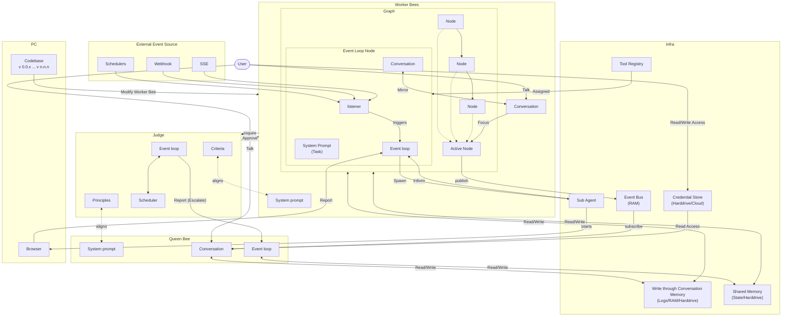

# Product Roadmap

Aden Agent Framework aims to help developers build outcome-oriented, self-adaptive agents. Please find our roadmap here

---

## Core Architecture & Swarm Primitives

### Node-Based Architecture
Implement the core execution engine where every Agent operates as an isolated, asynchronous graph of nodes.

- [x] **Core Node Implementation**
    - [x] NodeProtocol with JSON parsing utilities (graph/node.py)
    - [x] EventLoopNode with LLM conversation management (graph/event_loop_node.py)
    - [x] Flexible input/output keys with nullable output handling
    - [x] Node wrapper SDK for agent creation
    - [x] Tool access layer with MCP integration
- [x] **Graph Executor**
    - [x] Graph traversal execution (graph/executor.py)
    - [x] Node transition management
    - [x] Error handling and output mapping
    - [x] ExecutionResult with success/error status
- [x] **Shared Memory Access**
    - [x] SharedState manager (runtime/shared_state.py)
    - [x] Session-based storage (storage/session_store.py)
    - [x] Isolation levels: ISOLATED, SHARED, SYNCHRONIZED
- [ ] **Default Monitoring Hooks**
    - [ ] Performance metrics collection
    - [ ] Resource usage tracking
    - [ ] Health check endpoints

### Node Protocol
Build the standard communication protocol for inter-node messaging and data passing.

- [x] **Edge Specifications**
    - [x] ALWAYS: Always traverse (graph/edge.py)
    - [x] ON_SUCCESS: Success-based routing
    - [x] ON_FAILURE: Failure-based routing
    - [x] CONDITIONAL: Expression-based routing with safe_eval
    - [x] LLM_DECIDE: Goal-aware LLM-powered routing
- [x] **Event Bus System**
    - [x] Full event bus implementation (runtime/event_bus.py)
    - [x] LLM text deltas, tool calls, node transitions
    - [x] Graph-scoped event routing for multi-agent scenarios
- [x] **Conversation Management**
    - [x] NodeConversation tracks message history (graph/conversation.py)
    - [x] Tool results, streaming content, metadata support

### Judge in Event Loop
A separate LLM-powered judge to determine if the workers finish their job.

- [x] **Conversation Judge (Level 2)**
    - [x] Evaluates node completion against success criteria (graph/conversation_judge.py)
    - [x] Reads recent conversation and assesses quality
    - [x] Returns verdict: ACCEPT or RETRY with confidence scores
- [x] **Test Evaluation Judge**
    - [x] Provider-agnostic (OpenAI, Anthropic, Google Gemini) (testing/llm_judge.py)
    - [x] JSON response parsing for structured evaluation
- [ ] **Multi-Level Judgment Integration**
    - [ ] Judge node integration with event loop
    - [ ] Automatic retry logic based on judge verdict
    - [ ] Judge performance monitoring

### Swarm Hierarchy
Develop the distinct behavioral logic for the Queen Bee (Orchestrator), Judge Bee (Evaluator), and Worker Bee (Executor).

- [x] **Judge Bee (Evaluator)**
    - [x] Evaluation criteria framework (graph/goal.py)
    - [x] Success/failure determination
    - [x] Quality assessment with confidence scores
- [x] **Hive Coder Agent (Builder)**
    - [x] Coder node: forever-alive event loop (agents/hive_coder/nodes/)
    - [x] Guardian node: event-driven watchdog for supervised agents
    - [x] Tool discovery (discover_mcp_tools)
    - [x] Agent aware (list_agents, inspect sessions)
    - [x] Post-build testing (run_agent_tests)
    - [x] Debugging capabilities (inspect checkpoints, memory)
- [ ] **Queen Bee (Orchestrator)**
    - [ ] Multi-agent coordination layer
    - [ ] Task distribution logic
    - [ ] Dynamic worker agent creation
    - [ ] Swarm-level goal management
- [ ] **Worker Bee (Executor)**
    - [ ] Worker taxonomy definition
    - [ ] Worker agent templates
    - [ ] Task execution patterns

### Coding Agent Workflows
Implement the Goal Creation Session via the Queen Bee and the dynamic Worker Agent Creation flow.

- [x] **Goal Creation Session**
    - [x] Goal object schema definition (graph/goal.py)
    - [x] SuccessCriterion: Measurable success (5+ criteria per goal)
    - [x] Constraint: Hard/soft boundaries (time, cost, safety, scope, quality)
    - [x] GoalStatus: DRAFT → READY → ACTIVE → COMPLETED/FAILED
    - [x] Instruction back and forth in Hive Coder
    - [x] Test case generation
    - [x] Test case validation for worker agent
- [x] **Agent Creation Flow**
    - [x] Hive Coder reads templates and discovers tools (mcp/agent_builder_server.py)
    - [x] Generates agent.py, nodes/__init__.py, config.py
    - [x] MCP server configuration discovery
    - [x] Dynamic tool binding
- [ ] **Worker Agent Dynamic Creation**
    - [ ] Template agent initialization from Queen Bee
    - [ ] Runtime worker instantiation
    - [ ] Worker lifecycle management

### Security Layer
Build robust, local Credential Management interfaces for secure API key handling.

- [x] **Unified Credential Store**
    - [x] Multi-backend storage (credentials/store.py)
    - [x] EncryptedFileStorage: Encrypted local storage (~/.hive/credentials)
    - [x] EnvVarStorage: Environment variable mapping
    - [x] InMemoryStorage: Testing
    - [x] HashiCorp Vault: Enterprise secrets (credentials/storage.py)
    - [x] Template resolution: `{{cred.key}}` patterns
    - [x] Caching with TTL (default 5 min, configurable)
    - [x] Thread-safe operations with RLock
- [x] **OAuth2 Providers**
    - [x] Base provider pattern (credentials/oauth2/)
    - [x] HubSpot provider integration
    - [x] Lifecycle management (refresh tokens)
    - [x] Browser opening for auth flows (tools/credentials/browser.py)
- [x] **Aden Sync Provider**
    - [x] Syncs OAuth2 tokens from Aden authentication server (credentials/aden/)
    - [x] Falls back to local storage if Aden unavailable
    - [x] Auto-refresh on sync
- [ ] **Enterprise Secret Managers**
    - [ ] AWS Secrets Manager integration
    - [ ] Azure Key Vault integration
    - [ ] Audit logging for compliance/tracking
    - [ ] Per-environment configuration support

---

## Tooling Ecosystem & General Compute

### Sub-agents Parallel Execution
Develop the Sub-agent execution environment for parallel tasks execution. The subagents are designed with isolation for repeatability.

- [x] **Multi-Graph Sessions**
    - [x] Load multiple agent graphs in single session (runtime/agent_runtime.py)
    - [x] Shared state between graphs
    - [x] Independent execution streams
    - [x] Graph lifecycle management (load/unload/start/restart)
- [x] **Concurrent Execution Management**
    - [x] Max concurrent executions configuration
    - [x] Isolation levels: isolated, shared, synchronized
- [ ] **Sub-agent Execution Environment**
    - [ ] Isolated sub-agent runtime environment
    - [ ] Task isolation mechanisms
    - [ ] Result aggregation
    - [ ] Error handling for parallel tasks
    - [ ] Repeatability guarantees

### Browser Use Node
Implement native browser-integrated automation so agents can take over a browser for auth and agents perform the automation jobs. This node comes with a specific set of tools and system prompts.

- [x] **Web Scraping with Playwright**
    - [x] Headless Chromium launch (tools/web_scrape_tool/)
    - [x] Stealth mode via playwright_stealth
    - [x] JavaScript rendering with wait-for-domcontentloaded
    - [x] CSS selector support
    - [x] User-agent spoofing
    - [x] Sandbox/automation detection evasion
- [x] **Browser Launch Utilities**
    - [x] Platform-specific browser opening (macOS/Linux/Windows) (tools/credentials/browser.py)
    - [x] OAuth2 flow integration
- [ ] **Full Browser Use Node**
    - [ ] Multi-page automation workflows
    - [ ] Form filling with vision-guided interactions
    - [ ] Interactive screenshot capabilities
    - [ ] Session management across navigations
    - [ ] Browser-specific tool set
    - [ ] System prompts for browser tasks

### Core Graph Framework Infra
Ship essential framework utilities: Node validation, HITL (Human-in-the-loop pause/approve), and node lifecycle management.

- [x] **Node Validation**
    - [x] Pydantic-based validation
    - [x] Schema enforcement
    - [x] Output key validation (Level 0)
- [x] **Human-in-the-Loop (HITL)**
    - [x] HITLRequest and HITLResponse protocol (graph/hitl.py)
    - [x] Question types: FREE_TEXT, STRUCTURED, SELECTION, APPROVAL, MULTI_FIELD
    - [x] Haiku-powered response parsing
    - [x] User-friendly display formatting
    - [x] Pause/approve workflow
    - [x] State saved to checkpoint
    - [x] Resume with HITLResponse merged into context
- [x] **TUI Integration**
    - [x] Chat REPL with streaming support (tui/app.py)
    - [x] Multi-graph session management
    - [x] User presence detection
    - [x] Real-time log viewing
- [x] **Node Lifecycle Management**
    - [x] Start/stop/pause/resume in execution stream
    - [x] State persistence via checkpoint store
    - [x] Recovery mechanisms with checkpoint restore
- [ ] **Advanced HITL Features**
    - [ ] Callback handlers for custom intervention logic
    - [ ] Streaming interface for real-time monitoring
    - [ ] Approval workflows at scale

### Infrastructure Tools
Port popular tools, and build out the Runtime Log, Audit Trail, Excel, and Email integrations.

- [x] **File Operations (36+ tools)**
    - [x] read_file, write_file, edit_file (mcp/agent_builder_server.py)
    - [x] list_directory, search_files
    - [x] apply_diff / apply_patch for code modification (tools/file_system_toolkits/)
    - [x] data_tools (CSV/Excel parsing)
- [x] **Web Tools**
    - [x] Web Search (tools/web_search_tool/)
    - [x] Web Scraper (tools/web_scrape_tool/)
    - [x] Exa Search (tools/exa_search_tool/)
    - [x] News Tool (tools/news_tool/)
    - [x] SerpAPI (tools/serpapi_tool/)
- [x] **Data Tools**
    - [x] CSV tools (tools/csv_tool/)
    - [x] Excel tools (tools/excel_tool/)
    - [x] PDF tools (tools/pdf_read_tool/)
    - [x] Vision tool for image analysis (tools/vision_tool/)
    - [x] Time tool (tools/time_tool/)
- [x] **Communication Tools (8 tools)**
    - [x] Email tool (tools/email_tool/)
    - [x] Gmail tool (tools/gmail_tool/)
    - [x] Slack tool (tools/slack_tool/)
    - [x] Discord tool (tools/discord_tool/)
    - [x] Telegram tool (tools/telegram_tool/)
    - [x] Google Docs (tools/google_docs_tool/)
    - [x] Google Maps (tools/google_maps_tool/)
    - [x] Cal.com (tools/calcom_tool/)
- [x] **CRM/API Integrations (5+ tools)**
    - [x] HubSpot (tools/hubspot_tool/)
    - [x] GitHub (tools/github_tool/)
    - [x] Apollo (tools/apollo_tool/)
    - [x] BigQuery (tools/bigquery_tool/)
    - [x] Razorpay (tools/razorpay_tool/)
    - [x] Calendar (tools/calendar_tool/)
- [x] **Security/Scanning Tools (5 tools)**
    - [x] DNS Security Scanner (tools/dns_security_scanner/)
    - [x] SSL/TLS Scanner (tools/ssl_tls_scanner/)
    - [x] Port Scanner (tools/port_scanner/)
    - [x] Subdomain Enumerator (tools/subdomain_enumerator/)
    - [x] Tech Stack Detector (tools/tech_stack_detector/)
- [x] **Runtime & Logging**
    - [x] Runtime Log Tool (tools/runtime_logs_tool/)
    - [x] Runtime Logger with L1/L2/L3 levels (runtime/runtime_logger.py)
- [ ] **Audit Trail System**
    - [ ] Decision tracing beyond logs
    - [ ] Compliance reporting
    - [ ] Historical query capabilities

---

## Memory, Storage & File System Capabilities

### Memory Tools
Simple pure file-based memory management

- [x] **Short-Term Memory (STM)**
    - [x] SharedState manager for in-memory state (runtime/shared_state.py)
    - [x] Session-based storage (storage/session_store.py)
    - [x] State-based short-term memory layer
- [x] **Conversation Memory**
    - [x] NodeConversation tracks message history (graph/conversation.py)
    - [x] Tool results, streaming content, metadata
    - [x] Context building for LLM prompts
- [ ] **Long-Term Memory (LTM)**
    - [ ] Semantic indexing for memory retrieval
    - [ ] RLM (Retrieval-augmented Long-term Memory) implementation
    - [ ] Memory persistence beyond session
    - [ ] Content-based memory search

### Durable Scratchpad
Integrate a lightweight, persistent DB for long-term memory using the filesystem-as-scratchpad pattern.

- [x] **Filesystem as Scratchpad**
    - [x] File-based persistence layer (storage/)
    - [x] Session store implementation
    - [x] Data durability guarantees
- [x] **Checkpoint System**
    - [x] Save/restore execution state (storage/checkpoint_store.py)
    - [x] TTL-based cleanup
    - [x] Async checkpoint support
    - [x] Max age configuration
- [ ] **Message Model & Session Management**
    - [ ] Message class with structured content types
    - [ ] Session classes for conversation state
    - [ ] Per-message file persistence
    - [ ] Migration from monolithic run storage

### Memory Isolation
Enforce session-local memory isolation to prevent data bleed between concurrent agent runs.

- [x] **Session Isolation**
    - [x] Session-local memory implementation (storage/session_store.py)
    - [x] Data bleed prevention
    - [x] Concurrent run safety
    - [x] Isolation levels: ISOLATED, SHARED, SYNCHRONIZED
- [x] **State Management**
    - [x] SharedState with thread-safe operations (runtime/shared_state.py)
    - [x] Session-scoped state access
- [ ] **Context Management**
    - [ ] Message.stream(sessionID) implementation
    - [ ] Full context building optimization
    - [ ] Message to model conversion improvements

### Agent Capabilities
Implement File I/O support, streaming mode, and allow users to supply custom functions as libraries/nodes.

- [x] **File I/O**
    - [x] File read/write operations (mcp/agent_builder_server.py)
    - [x] File system navigation
    - [x] Directory listing and search
- [x] **Execution Streaming**
    - [x] Real-time event streaming (runtime/execution_stream.py)
    - [x] Token-by-token output via event bus
    - [x] Tool call streaming
- [x] **Custom Tool Integration**
    - [x] MCP server discovery (mcp/agent_builder_server.py)
    - [x] Dynamic tool binding
    - [x] Custom tool registration
- [ ] **Streaming Mode Enhancements**
    - [ ] Progressive result delivery optimization
    - [ ] Backpressure handling
- [ ] **Custom Function Libraries**
    - [ ] User-supplied function libraries as nodes
    - [ ] Library versioning and management
- [ ] **Proactive Memory Compaction**
    - [ ] Overflow detection
    - [ ] Backward-scanning pruning strategy
    - [ ] Token tracking integration for compaction decisions

### File System Enhancements
Add semantic search capabilities and an interactive file system for frontend product integration.

- [x] **File Search**
    - [x] search_files tool (mcp/agent_builder_server.py)
    - [x] Directory traversal
- [ ] **Semantic Search**
    - [ ] Semantic indexing of files
    - [ ] Natural language file search
    - [ ] Content-based retrieval with embeddings
- [ ] **Interactive File System**
    - [ ] Frontend file browser integration
    - [ ] Real-time file system updates
    - [ ] Visual file navigation in GUI

---

## Eval System, DX, & Open Source Guardrails

### Eval System
Build the failure recording mechanism and an SDK for defining custom failure conditions.

- [x] **Multi-Level Evaluation**
    - [x] Level 0: Output key validation (all required keys set)
    - [x] Level 1: Literal checks (output_contains, output_equals)
    - [x] Level 2: Conversation-aware judgment (graph/conversation_judge.py)
- [x] **Goal-Based Constraints**
    - [x] Hard constraints (violation = failure) (graph/goal.py)
    - [x] Soft constraints (prefer not to violate)
    - [x] Categories: time, cost, safety, scope, quality
    - [x] Constraint checking infrastructure
- [x] **Success Criteria Definition**
    - [x] Weighted criteria (0.0-1.0)
    - [x] Metrics: output_contains, output_equals, llm_judge, custom
    - [x] 90% threshold for goal success
- [x] **Test Framework**
    - [x] TestCase, TestResult, TestStorage classes (testing/)
    - [x] LLM-based judgment for semantic evaluation (testing/llm_judge.py)
    - [x] Approval CLI for manual approval workflows
    - [x] Categorization and test result reporting
- [ ] **Failure Recording**
    - [ ] Failure capture mechanism
    - [ ] Failure analysis tools
    - [ ] Historical failure tracking
    - [ ] Continuous improvement loop
- [ ] **Custom Failure Conditions SDK**
    - [ ] SDK for defining custom failure conditions
    - [ ] Custom evaluator framework extension
    - [ ] Condition validation DSL

### Guardrails SDK
Implement deterministic condition guardrails directly in the node, complete with mitigation tracking and audit logs.

- [x] **Goal Constraints (Basic Guardrails)**
    - [x] Hard/soft constraint definitions (graph/goal.py)
    - [x] Constraint checking in goals
- [ ] **Deterministic Guardrails SDK**
    - [ ] In-node guardrail implementation
    - [ ] Condition-based guardrails
    - [ ] Guardrail SDK for custom rules
- [ ] **Monitoring & Tracking**
    - [ ] Mitigation tracking for violations
    - [ ] Audit log system for guardrails
    - [ ] Compliance reporting
- [ ] **Basic Monitoring Hooks**
    - [ ] Agent node SDK monitoring hooks
    - [ ] Event hook system for guardrails
    - [ ] Default monitoring hooks in nodes

### DevTools CLI
Release CLI tools specifically for rapid memory management and credential store editing.

- [x] **Main CLI**
    - [x] Run, info, validate, list commands (cli.py)
    - [x] Dispatch mode for batch execution
    - [x] Shell mode for interactive use
    - [x] Model selection configuration
- [x] **Testing CLI**
    - [x] test-run, test-debug, test-list, test-stats (testing/cli.py)
    - [x] Pytest integration
    - [x] Test categorization
- [x] **TUI (Terminal UI)**
    - [x] Interactive chat with streaming (tui/app.py)
    - [x] Multi-graph management UI
    - [x] Log pane for real-time output
    - [x] Keyboard shortcuts (Ctrl+C, Ctrl+D, etc.)
- [ ] **Memory Management CLI**
    - [ ] Memory inspection commands
    - [ ] Memory cleanup utilities
    - [ ] Session management commands
- [ ] **Credential Store CLI**
    - [ ] Interactive credential editing
    - [ ] Secure credential viewer
    - [ ] Credential validation tools
- [ ] **Debugging Tools**
    - [ ] Interactive debugging mode beyond TUI
    - [ ] Breakpoint support in execution
    - [ ] Step-through execution

### Observability
Support user-driven log analysis, basic monitoring hooks from the SDK, and an interactive debugging mode.

- [x] **Runtime Logging**
    - [x] L1 (summary), L2 (detailed), L3 (tool) logging levels (runtime/runtime_logger.py)
    - [x] Session logs directory storage
    - [x] Audit trail for decision tracing in logs
- [x] **Event Bus Monitoring**
    - [x] Real-time event streaming (runtime/event_bus.py)
    - [x] LLM text deltas, tool calls, node transitions
    - [x] Graph-scoped event routing
- [ ] **Log Analysis Tools**
    - [ ] User-driven log analysis (OSS approach)
    - [ ] Log aggregation utilities
    - [ ] Log visualization tools
- [ ] **Monitoring Hooks**
    - [ ] Basic observability hooks from SDK
    - [ ] Performance metrics collection
    - [ ] Health checks system
- [ ] **Token Tracking**
    - [ ] Reasoning token tracking
    - [ ] Cache token tracking
    - [ ] Token metrics in compaction logic

### Developer Success
Write the Quick Start guide, detailed tool usage documentation, and set up the MVP README examples.

- [x] **Documentation**
    - [x] Quick start guide
    - [x] Goal creation guide
    - [x] Agent creation guide
    - [x] README with examples
    - [x] Contributing guidelines
    - [x] GitHub Page setup
- [ ] **Tool Usage Documentation**
    - [ ] Comprehensive tool documentation
    - [ ] Tool integration examples
    - [ ] Best practices guide
- [ ] **Video Content**
    - [ ] Introduction video
    - [ ] Tutorial videos
- [ ] **Example Agents**
    - [ ] Knowledge agent template
    - [ ] Blog writer agent template
    - [ ] SDR agent template

---

## Deployment, CI/CD & Community Templates

### Self-Deployment
Standardize the Docker container builds and establish headless backend execution APIs.

- [x] **Docker Support**
    - [x] Python 3.11-slim base image (tools/Dockerfile)
    - [x] Playwright Chromium installation
    - [x] Non-root user for security
    - [x] Health check endpoint
    - [x] Volume mount for workspace persistence
    - [x] Exposes port 4001 for MCP server
- [x] **Agent Runtime**
    - [x] AgentRuntime: Top-level orchestrator (runtime/agent_runtime.py)
    - [x] Multiple entry points (manual, webhook, timer, event, api)
    - [x] Concurrent execution management
    - [x] State persistence via session store
    - [x] Outcome aggregation
- [x] **Async Entry Points**
    - [x] AsyncEntryPointSpec: Webhook, timer, event triggers (graph/edge.py)
    - [x] Timer config: cron expressions or interval_minutes
    - [x] Event triggers for custom events
    - [x] Isolation levels: isolated, shared, synchronized
- [ ] **Headless Backend Enhancements**
    - [ ] Standardized backend execution APIs
    - [ ] Frontend attachment interface
    - [ ] Self-hosted setup guide with examples

### Lifecycle APIs
Expose basic REST/WebSocket endpoints for external control (Start, Stop, Pause, Resume).

- [x] **Webhook Server**
    - [x] FastAPI-based webhook server (runtime/webhook_server.py)
    - [x] Route configuration per entry point
    - [x] Optional secret validation
- [x] **Graph Lifecycle Management**
    - [x] Load/unload/start/restart in AgentRuntime
    - [x] State persistence
    - [x] Recovery mechanisms
- [ ] **REST API Endpoints**
    - [ ] Start endpoint for agent execution
    - [ ] Stop endpoint for graceful shutdown
    - [ ] Pause endpoint for execution suspension
    - [ ] Resume endpoint for continuation
    - [ ] Status query endpoint for monitoring
- [ ] **WebSocket API**
    - [ ] Real-time event streaming to clients
    - [ ] Bidirectional communication
    - [ ] Connection management with reconnection

### CI/CD Pipelines
Implement automated test execution, agent version control, and mandatory test-passing for deployment.

- [x] **Test Execution**
    - [x] Test framework with pytest integration (testing/)
    - [x] Test result reporting
    - [x] Test CLI commands (test-run, test-debug, etc.)
- [ ] **Automated Testing Pipeline**
    - [ ] CI integration (GitHub Actions, etc.)
    - [ ] Mandatory test-passing gates
    - [ ] Coverage reporting
- [ ] **Version Control**
    - [ ] Agent versioning system
    - [ ] Semantic versioning for agents
    - [ ] Version compatibility checks
- [ ] **Deployment Automation**
    - [ ] Continuous deployment pipeline
    - [ ] Rollback mechanisms
    - [ ] Blue-green deployment support

### Distribution
Launch the official PyPI package, Docker Hub image, and the community Discord channel.

- [ ] **Package Distribution**
    - [ ] Official PyPI package
    - [ ] Docker Hub image publication
    - [ ] Version release automation
    - [ ] Installation documentation
- [ ] **Community Channels**
    - [ ] Discord channel setup
    - [ ] Community support structure
    - [ ] Contribution guidelines enforcement
- [ ] **Cloud Deployment**
    - [ ] AWS Lambda integration
    - [ ] GCP Cloud Functions support
    - [ ] Azure Functions support
    - [ ] 3rd-party platform integrations
    - [ ] Self-deploy with orchestrator connection

### Example Agents
Ship ~20 ready-to-use templates including GTM Sales, Marketing, Analytics, Training, and Smart Entry agents.

- [x] **Hive Coder Agent**
    - [x] Agent builder template (agents/hive_coder/)
    - [x] Guardian node for supervision
- [ ] **Sales & Marketing Agents**
    - [ ] GTM Sales Agent (workflow automation)
    - [ ] GTM Marketing Agent (campaign management)
    - [ ] Lead generation agent
    - [ ] Email campaign agent
    - [ ] Social media agent
- [ ] **Analytics & Insights Agents**
    - [ ] Analytics Agent (data analysis)
    - [ ] Data processing agent
    - [ ] Report generation agent
    - [ ] Dashboard agent
- [ ] **Training & Education Agents**
    - [ ] Training Agent (onboarding)
    - [ ] Content creation agent
    - [ ] Knowledge base agent
    - [ ] Documentation agent
- [ ] **Automation & Forms Agents**
    - [ ] Smart Entry / Form Agent (self-evolution emphasis)
    - [ ] Data validation agent
    - [ ] Workflow automation agent
    - [ ] Integration agent
- [ ] **Additional Templates**
    - [ ] Customer support agent
    - [ ] Document processing agent
    - [ ] Scheduling agent
    - [ ] Research agent
    - [ ] Code review agent

---

## Open Hive

### Local API Gateway
Build a lightweight local server (e.g., FastAPI or Node) that securely exposes the Hive framework's core Event Bus and Memory Layer to the local browser environment.

- [x] **MCP Server Foundation**
    - [x] FastMCP server implementation (mcp/agent_builder_server.py)
    - [x] Agent builder tools exposed
    - [x] Port 4001 exposed in Docker
- [x] **Event Bus Architecture**
    - [x] Event Bus implementation (runtime/event_bus.py)
    - [x] Real-time event streaming
    - [x] Graph-scoped event routing
- [ ] **Local API Gateway**
    - [ ] Lightweight local server (FastAPI or Node)
    - [ ] Secure authentication layer for browser
    - [ ] CORS and security configuration
    - [ ] Event Bus API endpoints for browser access
    - [ ] Event subscription management for frontend
- [ ] **Memory Layer API**
    - [ ] Memory read/write endpoints
    - [ ] Session management API for frontend
    - [ ] Memory visualization data endpoints

### Visual Graph Explorer
Implement an interactive, drag-and-drop canvas (using libraries like React Flow) to visualize the Worker Graph, Queen Bee, and active execution paths in real-time.

- [ ] **Graph Visualization**
    - [ ] React Flow integration
    - [ ] Worker Graph rendering from agent definitions
    - [ ] Node type visualization (EventLoop, Function, etc.)
    - [ ] Edge visualization with condition types
    - [ ] Active execution path highlighting
- [ ] **Interactive Features**
    - [ ] Drag-and-drop canvas for graph editing
    - [ ] Node editing capabilities
    - [ ] Real-time graph updates during execution
    - [ ] Zoom and pan controls
    - [ ] Node inspection on click
- [ ] **Integration with Runtime**
    - [ ] Live execution visualization
    - [ ] Node state indicators
    - [ ] Edge traversal animation

### TUI to GUI Upgrade
Port the existing Terminal User Interface (TUI) into a rich web application, allowing users to interact directly with the Queen Bee / Coding Agent via a browser chat interface.

- [x] **TUI Foundation**
    - [x] Terminal chat interface (tui/app.py)
    - [x] Streaming support
    - [x] Multi-graph management
    - [x] Log pane display
    - [x] Keyboard shortcuts
- [ ] **Web Application**
    - [ ] Modern web UI framework setup (React/Vue/Svelte)
    - [ ] Responsive design implementation
    - [ ] Cross-browser compatibility
- [ ] **Chat Interface**
    - [ ] Browser-based chat UI
    - [ ] Hive Coder interaction (Queen Bee proxy)
    - [ ] Coding Agent interface
    - [ ] Message history and search
    - [ ] Rich message formatting (markdown, code blocks)
- [ ] **TUI Feature Parity**
    - [ ] All TUI commands in GUI
    - [ ] Keyboard shortcuts in browser
    - [ ] Command palette (Cmd+K style)

### Memory & State Inspector
Create a UI component to inspect the Shared Memory and Write-Through Conversation Memory, allowing developers to click on any node and see exactly what it is thinking.

- [x] **Runtime Logs Tool**
    - [x] Inspect agent session logs (tools/runtime_logs_tool/)
    - [x] Session state retrieval (mcp/agent_builder_server.py)
- [ ] **Memory Inspector UI**
    - [ ] Shared Memory visualization
    - [ ] Conversation memory view (NodeConversation display)
    - [ ] Memory search and filter
    - [ ] Memory timeline view
- [ ] **Node State Inspection**
    - [ ] Click-to-inspect functionality
    - [ ] Node thought process display (LLM reasoning)
    - [ ] State history timeline per node
    - [ ] Input/output inspection
- [ ] **Debug Tools**
    - [ ] Memory diff viewer (state changes between nodes)
    - [ ] State snapshot comparison
    - [ ] Memory leak detection

### Local Control Panel
Build a dashboard for localized Credential Management (editing the ~/.hive/credentials store safely) and swarm lifecycle management (Start, Pause, Kill, and HITL approvals).

- [x] **Credential Management Backend**
    - [x] CredentialStore with file/env/vault backends (credentials/store.py)
    - [x] OAuth2 provider support (credentials/oauth2/)
    - [x] Template resolution and caching
- [ ] **Credential Management Dashboard**
    - [ ] Safe credential editing interface (web UI)
    - [ ] ~/.hive/credentials store management UI
    - [ ] Credential validation and testing UI
    - [ ] Encryption status display
    - [ ] OAuth2 flow initiation from browser
- [ ] **Swarm Lifecycle Management**
    - [ ] Start/Stop controls for agents
    - [ ] Pause/Resume functionality
    - [ ] Kill process management
    - [ ] HITL approval interface in browser
    - [ ] Multi-agent orchestration view
- [ ] **Monitoring Dashboard**
    - [ ] Active agents display
    - [ ] Resource usage monitoring (CPU, memory, tokens)
    - [ ] Performance metrics visualization
    - [ ] Execution history

### Local Model Integration
Build native frontend configurations to easily connect Open Hive's backend to local open-source inference engines like Ollama, keeping the entire stack offline and private.

- [x] **LLM Integration Layer**
    - [x] Provider-agnostic LLM support via LiteLLM (graph/event_loop_node.py)
    - [x] Model configuration in agent definitions
- [ ] **Local Model Support**
    - [ ] Ollama integration and configuration
    - [ ] Local LLM configuration UI
    - [ ] Model selection and management dashboard
    - [ ] Model performance monitoring
- [ ] **Offline Mode**
    - [ ] Full offline functionality (no cloud API calls)
    - [ ] Local-only execution mode flag
    - [ ] Privacy-first architecture enforcement
    - [ ] Local model fallback mechanisms
- [ ] **Model Configuration**
    - [ ] Easy model switching in UI
    - [ ] Model parameter tuning (temperature, top_p, etc.)
    - [ ] Performance optimization settings
    - [ ] Multi-model support (different models per node)
    - [ ] Model cost tracking for local models

### Cross-Platform Support
- [ ] **JavaScript/TypeScript SDK**
    - [ ] TypeScript SDK development
    - [ ] npm package distribution
    - [ ] Node.js runtime support
    - [ ] Browser runtime support
- [ ] **Platform Compatibility**
    - [ ] Windows support improvements
    - [ ] macOS optimization
    - [ ] Linux distribution support

### Coding Agent Integration
- [ ] **IDE Integrations**
    - [ ] Claude Code integration
    - [ ] Cursor integration
    - [ ] Opencode integration
    - [ ] Antigravity integration
    - [ ] Codex CLI integration (in progress)
